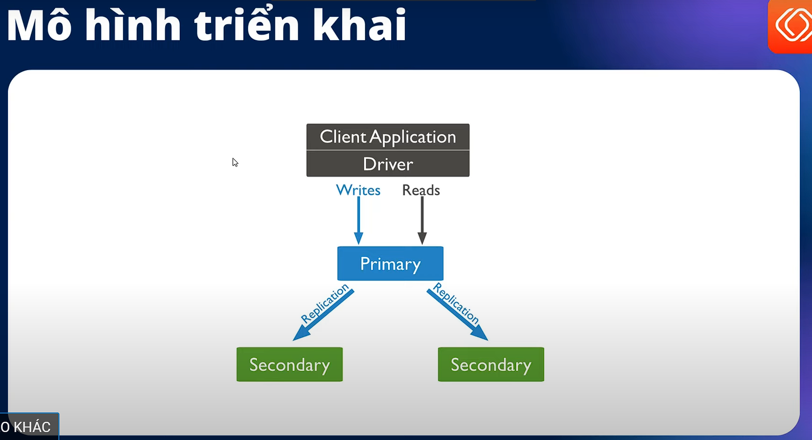

# MongoDB Cluster High Availability (VIP)

# Mô hình triển khai



- Có 3 server, 1 server là primary (read/wirte), 2 server còn lại là secondary (Only read) (master-slave )
- Ví dụ khi server 1 là primary bị lỗi, thì lập tức hệ thống sẽ đề cử một server khác hay một Node khác ở trong cụm lên làm primary => để đảm bảo là khi có 1 server bị lỗi thì hệ thống của ta vẫn hoạt động bình thường
- Ở đây mình sẽ sử dụng các nâng cao và thực tế là sử dụng VIP (Virtual IP) hay IP ảo, tức là khi cài cả 3 server tức là trong code của ta sẽ phải cấu hình cả 3 IP, nên khi ta cấu hình thêm VIP thì ta chỉ cần kết nối đến đúng một IP ảo đó thôi và hệ thống tự có nhiệm vụ điều phối các cái traffic cũng như là kết nối tới primary để đọc và ghi chính xác

# Cài đặt MongoDB trên cả 3 srrver

Cài đặt các công cụ cần thiết

## Cài đặt các công cụ cần thiết

```bash
# check port, kết nối
apt install -y net-tools telnet traceroute
```

## Cài đặt MongoDB version 7.0.x

```bash
apt install software-properties-common gn upg apt-transport-https ca-certificates -y

curl -fsSL https://pgp.mongodb.com/server-7.0.asc | sudo gpg -o /usr/share/keyrings/mongodb-server-7.0.gpg --dearmor

echo "deb [ arch=amd64,arm64 signed-by=/usr/share/keyrings/mongodb-server-7.0.gpg ] https://repo.mongodb.org/apt/ubuntu jammy/mongodb-org/7.0 multiverse" | sudo tee /etc/apt/sources.list.d/mongodb-org-7.0.list

apt update

apt install mongodb-org -y

```

## Kiểm tra version

```bash
mongod --version
# Tại sao lại là mongod (giống việc tạo một service để sử dụng với systemctl như thế nào)
# kiểm tra
 ls /lib/systemd/system/mo

# modprobe@.service  mongod.service     motd-news.service  motd-news.timer
# root@server-2:/HA-tools/MongoDB# ls /lib/systemd/system/mo

systemctl status mongod

# ○ mongod.service - MongoDB Database Server
#      Loaded: loaded (/usr/lib/systemd/system/mongod.service; disabled; preset: enabled)
#      Active: inactive (dead)
#        Docs: https://docs.mongodb.org/manual
# root@server-2:/HA-tools/MongoDB#

# trạng thái đang là inactive lên ta  phải start nó lên

systemctl start mongod
systemctl status mongod

netstat -tlpun

# Active Internet connections (only servers)
# Proto Recv-Q Send-Q Local Address           Foreign Address         State       PID/Program name
# tcp        0      0 127.0.0.1:27017         0.0.0.0:*               LISTEN      2157/mongod
# tcp        0      0 127.0.0.53:53           0.0.0.0:*               LISTEN      603/systemd-resolve
# tcp        0      0 127.0.0.54:53           0.0.0.0:*               LISTEN      603/systemd-resolve
# tcp6       0      0 :::22                   :::*                    LISTEN      1/init
# udp        0      0 127.0.0.54:53           0.0.0.0:*                           603/systemd-resolve
# udp        0      0 127.0.0.53:53           0.0.0.0:*                           603/systemd-resolve
# root@server-2:/HA-tools/MongoDB#

# Từ đây ta có thể  thấy mongodb đang chạy nhưng chỉ expose với localhost, đề một cluster hoạt động thì chắc các server phải kết nối được tới nhau
# Có thể ssh sang server 2 để kiểm tra
telnet 192.168.72.11:27017
# Server lookup failure:  192.168.72.11:27017:telnet, Name or service not known
# root@server-2:/HA-tools/MongoDB#

```

==> Chính vì vậy ta cần sửa cấu hình để cho các server có thể kết nối được với nhau
**Lưu ý**: Cần mở port chính xác trên firewall để cài đặt và triển khai thành công

# Mở file cấu hình để chỉnh sửa thiết lập mongodb thành cluster

```bash
vi /etc/mongod.conf
```

## Tìm và sửa 2 phần này trong file (Cấu hình tương tự trên cả 3 server)

```sh
bindIp: 0.0.0.0


replication:
  replSetName: "mongodb-cluster-viettu"
```

## Khởi động lại mongodb để áp dụng cấu hình mới

```bash
systemctl restart mongod
```

# Thực hiện trên `server 1`

## Khởi tạo cụm mongodb

### Truy cập môi trường mongodb

```bash
    # truy cập vào môi trường mongodb
    mongosh
```

### Khởi tạo cụm

```bash
test> rs.initiate( {
      _id : "mongodb-cluster-viettu",
      members: [
         { _id: 0, host: "server-1:27017" },
         { _id: 1, host: "server-2:27017" },
         { _id: 2, host: "server-3:27017" }
      ]
   })

# kiểm tra

test> rs.status()

# mongodb-cluster-viettu [direct: primary] test> rs.status()
# {
#   set: 'mongodb-cluster-viettu', ## TÊN CLUSTER
#   date: ISODate('2024-08-18T16:05:08.429Z'),
#   myState: 1,
#   term: Long('1'),
#   syncSourceHost: '',
#   syncSourceId: -1,
#   heartbeatIntervalMillis: Long('2000'),
#   majorityVoteCount: 2,
#   writeMajorityCount: 2,
#   votingMembersCount: 3,
#   writableVotingMembersCount: 3,
#   optimes: {
#     lastCommittedOpTime: { ts: Timestamp({ t: 1723997100, i: 1 }), t: Long('1') },
#     lastCommittedWallTime: ISODate('2024-08-18T16:05:00.917Z'),
#     readConcernMajorityOpTime: { ts: Timestamp({ t: 1723997100, i: 1 }), t: Long('1') },
#     appliedOpTime: { ts: Timestamp({ t: 1723997100, i: 1 }), t: Long('1') },
#     durableOpTime: { ts: Timestamp({ t: 1723997100, i: 1 }), t: Long('1') },
#     lastAppliedWallTime: ISODate('2024-08-18T16:05:00.917Z'),
#     lastDurableWallTime: ISODate('2024-08-18T16:05:00.917Z')
#   },
#   lastStableRecoveryTimestamp: Timestamp({ t: 1723997074, i: 2 }),
#   electionCandidateMetrics: {
#     lastElectionReason: 'electionTimeout',
#     lastElectionDate: ISODate('2024-08-18T16:03:50.849Z'),
#     electionTerm: Long('1'),
#     lastCommittedOpTimeAtElection: { ts: Timestamp({ t: 1723997020, i: 1 }), t: Long('-1') },
#     lastSeenOpTimeAtElection: { ts: Timestamp({ t: 1723997020, i: 1 }), t: Long('-1') },
#     numVotesNeeded: 2,
#     priorityAtElection: 1,
#     electionTimeoutMillis: Long('10000'),
#     numCatchUpOps: Long('0'),
#     newTermStartDate: ISODate('2024-08-18T16:03:50.898Z'),
#     wMajorityWriteAvailabilityDate: ISODate('2024-08-18T16:03:51.420Z')
#   },
#   members: [
#     {
#       _id: 0,
#       name: 'server-1:27017', ## NAME
#       health: 1, ## 1 TỨC LÀ ĐANG HOẠT ĐỘNG
#       state: 1,
#       stateStr: 'PRIMARY', ## SERVER-1 ĐANG LÀ PRIMARY
#       uptime: 634,
#       optime: { ts: Timestamp({ t: 1723997100, i: 1 }), t: Long('1') },
#       optimeDate: ISODate('2024-08-18T16:05:00.000Z'),
#       lastAppliedWallTime: ISODate('2024-08-18T16:05:00.917Z'),
#       lastDurableWallTime: ISODate('2024-08-18T16:05:00.917Z'),
#       syncSourceHost: '',
#       syncSourceId: -1,
#       infoMessage: 'Could not find member to sync from',
#       electionTime: Timestamp({ t: 1723997030, i: 1 }),
#       electionDate: ISODate('2024-08-18T16:03:50.000Z'),
#       configVersion: 1,
#       configTerm: 1,
#       self: true,
#       lastHeartbeatMessage: ''
#     },
#     {
#       _id: 1,
#       name: 'server-2:27017',
#       health: 1,
#       state: 2,
#       stateStr: 'SECONDARY', ## SERVER-2 ĐANG LÀ SECONDARY (HAY SLAVE)
#       uptime: 88,
#       optime: { ts: Timestamp({ t: 1723997100, i: 1 }), t: Long('1') },
#       optimeDurable: { ts: Timestamp({ t: 1723997100, i: 1 }), t: Long('1') },
#       optimeDate: ISODate('2024-08-18T16:05:00.000Z'),
#       optimeDurableDate: ISODate('2024-08-18T16:05:00.000Z'),
#       lastAppliedWallTime: ISODate('2024-08-18T16:05:00.917Z'),
#       lastDurableWallTime: ISODate('2024-08-18T16:05:00.917Z'),
#       lastHeartbeat: ISODate('2024-08-18T16:05:06.961Z'),
#       lastHeartbeatRecv: ISODate('2024-08-18T16:05:07.965Z'),
#       pingMs: Long('0'),
#       lastHeartbeatMessage: '',
#       syncSourceHost: 'server-1:27017', ### NGHĨA LÀ ĐỒNG BỘ DỮ LIỆU TỪ MONGODB SERVER-1 SANG
#       syncSourceId: 0,
#       infoMessage: '',
#       configVersion: 1,
#       configTerm: 1
#     },
#     {
#       _id: 2,
#       name: 'server-3:27017',
#       health: 1,
#       state: 2,
#       stateStr: 'SECONDARY', ## SERVER-3 ĐANG LÀ SECONDARY (HAY SLAVE)
#       uptime: 88,
#       optime: { ts: Timestamp({ t: 1723997100, i: 1 }), t: Long('1') },
#       optimeDurable: { ts: Timestamp({ t: 1723997100, i: 1 }), t: Long('1') },
#       optimeDate: ISODate('2024-08-18T16:05:00.000Z'),
#       optimeDurableDate: ISODate('2024-08-18T16:05:00.000Z'),
#       lastAppliedWallTime: ISODate('2024-08-18T16:05:00.917Z'),
#       lastDurableWallTime: ISODate('2024-08-18T16:05:00.917Z'),
#       lastHeartbeat: ISODate('2024-08-18T16:05:06.962Z'),
#       lastHeartbeatRecv: ISODate('2024-08-18T16:05:07.965Z'),
#       pingMs: Long('0'),
#       lastHeartbeatMessage: '',
#       syncSourceHost: 'server-1:27017', ### NGHĨA LÀ ĐỒNG BỘ DỮ LIỆU TỪ MONGODB SERVER-1 SANG
#       syncSourceId: 0,
#       infoMessage: '',
#       configVersion: 1,
#       configTerm: 1
#     }
#   ],
#   ok: 1,
#   '$clusterTime': {
#     clusterTime: Timestamp({ t: 1723997100, i: 1 }),
#     signature: {
#       hash: Binary.createFromBase64('AAAAAAAAAAAAAAAAAAAAAAAAAAA=', 0),
#       keyId: Long('0')
#     }
#   },
#   operationTime: Timestamp({ t: 1723997100, i: 1 })
# }
 mongodb-cluster-viettu [direct: primary] test> # Ở đây ta có thể thấy mongodb ở server là primary

 ## Gọi đến hàm nữa
test> rs.isMaster()

# {
#   topologyVersion: {
#     processId: ObjectId('66c2193a6591f8241bc7bc0a'),
#     counter: Long('6')
#   },
#   hosts: [ 'server-1:27017', 'server-2:27017', 'server-3:27017' ],
#   setName: 'mongodb-cluster-viettu',
#   setVersion: 1,
#   ismaster: true,
#   secondary: false,
#   primary: 'server-1:27017', #############
#   me: 'server-1:27017', ### Hiện tại ta đang ở Node nào
#   electionId: ObjectId('7fffffff0000000000000001'),
#   lastWrite: {
#     opTime: { ts: Timestamp({ t: 1723997460, i: 1 }), t: Long('1') },
#     lastWriteDate: ISODate('2024-08-18T16:11:00.000Z'),
#     majorityOpTime: { ts: Timestamp({ t: 1723997460, i: 1 }), t: Long('1') },
#     majorityWriteDate: ISODate('2024-08-18T16:11:00.000Z')
#   },
#   maxBsonObjectSize: 16777216,
#   maxMessageSizeBytes: 48000000,
#   maxWriteBatchSize: 100000,
#   localTime: ISODate('2024-08-18T16:11:06.107Z'),
#   logicalSessionTimeoutMinutes: 30,
#   connectionId: 7,
#   minWireVersion: 0,
#   maxWireVersion: 21,
#   readOnly: false,
#   ok: 1,
#   '$clusterTime': {
#     clusterTime: Timestamp({ t: 1723997460, i: 1 }),
#     signature: {
#       hash: Binary.createFromBase64('AAAAAAAAAAAAAAAAAAAAAAAAAAA=', 0),
#       keyId: Long('0')
#     }
#   },
#   operationTime: Timestamp({ t: 1723997460, i: 1 }),
#   isWritablePrimary: true
# }
# mongodb-cluster-viettu [direct: primary] test>

mongodb-cluster-viettu [direct: secondary] test> rs.status()
mongodb-cluster-viettu [direct: primary] test> rs.isMaster()


```

# Kiểm tra mongodb đã chạy đúng chư, bằng cách tạo db, tạo data trên mongodb master xem data của server master có đồng bộ sang mongodb của server 2 và server 3 không

## Thêm thử dữ liệu test tính HA

```bash
mongodb-cluster-viettu [direct: primary] test> use viettudb
mongodb-cluster-viettu [direct: primary] viettudb> db.courses.insertOne({ "name": ["Hello world", "pipeline Viettu", "HA tools"] })
# {
#   acknowledged: true, ## thêm thành công data
#   insertedId: ObjectId('66c21e673c37f9ccdd5e739c')
# }
# mongodb-cluster-viettu [direct: primary] viettudb>
```

# Thực hiện trên server 2 hoặc server 3

Kiểm tra tính đồng bộ dữ liệu

## Truy cập môi trường mongodb

```bash
 mongosh
```

## Kiểm tra dữ liệu

```bash

mongodb-cluster-viettu [direct: secondary] test> show dbs
# admin      80.00 KiB
# config    232.00 KiB
# local     452.00 KiB
# viettudb   40.00 KiB
mongodb-cluster-viettu [direct: secondary] test> use viettudb
# switched to db viettudb
mongodb-cluster-viettu [direct: secondary] viettudb> show collections
# courses
mongodb-cluster-viettu [direct: secondary] viettudb> db.courses.find()
# [
#   {
#     _id: ObjectId('66c21e673c37f9ccdd5e739c'),
#     name: [ 'Hello world', 'pipeline Viettu', 'HA tools' ]
#   }
# ]
mongodb-cluster-viettu [direct: secondary] viettudb>
```

## Kiểm tra tính cluster replica không thể thêm dữ liệu

```bash
mongodb-cluster-viettu [direct: secondary] viettudb> db.accounts.insertOne({ "username": ["viettu", "mongodb"] })
MongoServerError[NotWritablePrimary]: not primary
mongodb-cluster-viettu [direct: secondary] viettudb>
```

# Thực hiện trên server 1

`thủ tắt server 1 để xem server thứ 2 có được đề xuất lên làm master không, bởi vì mongodb ở server-1 đang là master`

Kiểm tra tính HA

## Tắt/khởi động lại server giả định server bị lỗi

```bash
 reboot
```

# Thực hiện trên server 2 hoặc server 3

Kiểm tra tính HA

## Kiểm tra xem mongodb server 2 hoặc 3 xem được đề xuất làm primary không tương tự như video bài giảng

```bash
mongodb-cluster-viettu [direct: secondary] viettudb> rs.status()


#   members: [
#     {
#       _id: 0,
#       name: 'server-1:27017',
#       health: 0, ## Ở ĐÂY TA CÓ THẤY TRẠNG THÁI CHECK LÀ TRỞ VỀ 0, TỨC LÀ KHÔNG KHẢ DỤNG, SERVER 2 ĐÃ ĐƯỢC ĐỀ CỬ LÀM PRIMARY
#       state: 8,
#       stateStr: '(not reachable/healthy)',
#       uptime: 0,
#       optime: { ts: Timestamp({ t: 0, i: 0 }), t: Long('-1') },
#       optimeDurable: { ts: Timestamp({ t: 0, i: 0 }), t: Long('-1') },
#       optimeDate: ISODate('1970-01-01T00:00:00.000Z'),
#       optimeDurableDate: ISODate('1970-01-01T00:00:00.000Z'),
#       lastAppliedWallTime: ISODate('2024-08-18T16:24:52.361Z'),
#       lastDurableWallTime: ISODate('2024-08-18T16:24:52.361Z'),
#       lastHeartbeat: ISODate('2024-08-18T16:25:42.009Z'),
#       lastHeartbeatRecv: ISODate('2024-08-18T16:24:56.893Z'),
#       pingMs: Long('0'),
#       lastHeartbeatMessage: 'Error connecting to server-1:27017 (192.168.72.11:27017) :: caused by :: onInvoke :: caused by :: Connection refused',
#       syncSourceHost: '',
#       syncSourceId: -1,
#       infoMessage: '',
#       configVersion: 1,
#       configTerm: 2
#     },
#     {
#       _id: 1,
#       name: 'server-2:27017',
#       health: 1,
#       state: 1,
#       stateStr: 'PRIMARY', SERVER 2 ĐÃ ĐƯỢC ĐỀ CỬ LÀM PRIMARY
#       uptime: 1813,
#       optime: { ts: Timestamp({ t: 1723998330, i: 1 }), t: Long('2') },
#       optimeDate: ISODate('2024-08-18T16:25:30.000Z'),
#       lastAppliedWallTime: ISODate('2024-08-18T16:25:30.327Z'),
#       lastDurableWallTime: ISODate('2024-08-18T16:25:30.327Z'),
#       syncSourceHost: '',
#       syncSourceId: -1,
#       infoMessage: '',
#       electionTime: Timestamp({ t: 1723998282, i: 1 }),
#       electionDate: ISODate('2024-08-18T16:24:42.000Z'),
#       configVersion: 1,
#       configTerm: 2,
#       self: true,
#       lastHeartbeatMessage: ''
#     },
#     {
#       _id: 2,
#       name: 'server-3:27017',
#       health: 1,
#       state: 2,
#       stateStr: 'SECONDARY', SERVER 3 VẪN LÀM SECONDARY, NHƯNG MÀ ĐƯỢC ĐỒNG BỘ TỪ SERVER-2
#       uptime: 1321,
#       optime: { ts: Timestamp({ t: 1723998330, i: 1 }), t: Long('2') },
#       optimeDurable: { ts: Timestamp({ t: 1723998330, i: 1 }), t: Long('2') },
#       optimeDate: ISODate('2024-08-18T16:25:30.000Z'),
#       optimeDurableDate: ISODate('2024-08-18T16:25:30.000Z'),
#       lastAppliedWallTime: ISODate('2024-08-18T16:25:30.327Z'),
#       lastDurableWallTime: ISODate('2024-08-18T16:25:30.327Z'),
#       lastHeartbeat: ISODate('2024-08-18T16:25:40.412Z'),
#       lastHeartbeatRecv: ISODate('2024-08-18T16:25:40.923Z'),
#       pingMs: Long('0'),
#       lastHeartbeatMessage: '',
#       syncSourceHost: 'server-2:27017', ##  NHƯNG MÀ ĐƯỢC ĐỒNG BỘ TỪ SERVER-2
#       syncSourceId: 1,
#       infoMessage: '',
#       configVersion: 1,
#       configTerm: 2
#     }
#   ],
#   ok: 1,
#   '$clusterTime': {
#     clusterTime: Timestamp({ t: 1723998330, i: 1 }),
#     signature: {
#       hash: Binary.createFromBase64('AAAAAAAAAAAAAAAAAAAAAAAAAAA=', 0),
#       keyId: Long('0')
#     }
#   },
#   operationTime: Timestamp({ t: 1723998330, i: 1 })
# }

```

===> **Chú ý:** khi ta khởi động lại server 1 thì mongodb của ta sẽ không chạy vì ta chưa sử dụng tùy chọn `enable`

```bash
root@server-1:~# systemctl status mongod
# ○ mongod.service - MongoDB Database Server
#      Loaded: loaded (/usr/lib/systemd/system/mongod.service; disabled; preset: enabled)
#      Active: inactive (dead)
#        Docs: https://docs.mongodb.org/manual
root@server-1:~# systemctl start mongod
root@server-1:~# systemctl enable mongod
Created symlink /etc/systemd/system/multi-user.target.wants/mongod.service → /usr/lib/systemd/system/mongod.service.
root@server-1:~#

```

### Bây giờ `server-1` đã thành `secondary` (server-1 đã được jon vào cum và hiện tại là `secondary` không phải master ban đầu nữa)

```bash
root@server-1:~# mongosh
Current Mongosh Log ID: 66c2227bb60e9be9965e739b
Connecting to:          mongodb://127.0.0.1:27017/?directConnection=true&serverSelectionTimeoutMS=2000&appName=mongosh+2.3.0
Using MongoDB:          7.0.12
Using Mongosh:          2.3.0

mongodb-cluster-viettu [direct: secondary] test> ## SECONDARY
mongodb-cluster-viettu [direct: secondary] test> rs.status()

#   members: [
#     {
#       _id: 0,
#       name: 'server-1:27017',
#       health: 1,
#       state: 2,
#       stateStr: 'SECONDARY',
#       uptime: 212,
#       optime: { ts: Timestamp({ t: 1723998982, i: 1 }), t: Long('2') },
#       optimeDate: ISODate('2024-08-18T16:36:22.000Z'),
#       lastAppliedWallTime: ISODate('2024-08-18T16:36:22.410Z'),
#       lastDurableWallTime: ISODate('2024-08-18T16:36:22.410Z'),
#       syncSourceHost: 'server-3:27017', ### Được đồng bộ tử server-3
#       syncSourceId: 2,
#       infoMessage: '',
#       configVersion: 1,
#       configTerm: 2,
#       self: true,
#       lastHeartbeatMessage: ''
#     },
#     {
#       _id: 1,
#       name: 'server-2:27017',
#       health: 1,
#       state: 1,
#       stateStr: 'PRIMARY',
#       uptime: 209,
#       optime: { ts: Timestamp({ t: 1723998982, i: 1 }), t: Long('2') },
#       optimeDurable: { ts: Timestamp({ t: 1723998982, i: 1 }), t: Long('2') },
#       optimeDate: ISODate('2024-08-18T16:36:22.000Z'),
#       optimeDurableDate: ISODate('2024-08-18T16:36:22.000Z'),
#       lastAppliedWallTime: ISODate('2024-08-18T16:36:22.410Z'),
#       lastDurableWallTime: ISODate('2024-08-18T16:36:22.410Z'),
#       lastHeartbeat: ISODate('2024-08-18T16:36:31.352Z'),
#       lastHeartbeatRecv: ISODate('2024-08-18T16:36:31.042Z'),
#       pingMs: Long('0'),
#       lastHeartbeatMessage: '',
#       syncSourceHost: '',
#       syncSourceId: -1,
#       infoMessage: '',
#       electionTime: Timestamp({ t: 1723998282, i: 1 }),
#       electionDate: ISODate('2024-08-18T16:24:42.000Z'),
#       configVersion: 1,
#       configTerm: 2
#     },
#     {
#       _id: 2,
#       name: 'server-3:27017',
#       health: 1,
#       state: 2,
#       stateStr: 'SECONDARY',
#       uptime: 209,
#       optime: { ts: Timestamp({ t: 1723998982, i: 1 }), t: Long('2') },
#       optimeDurable: { ts: Timestamp({ t: 1723998982, i: 1 }), t: Long('2') },
#       optimeDate: ISODate('2024-08-18T16:36:22.000Z'),
#       optimeDurableDate: ISODate('2024-08-18T16:36:22.000Z'),
#       lastAppliedWallTime: ISODate('2024-08-18T16:36:22.410Z'),
#       lastDurableWallTime: ISODate('2024-08-18T16:36:22.410Z'),
#       lastHeartbeat: ISODate('2024-08-18T16:36:31.351Z'),
#       lastHeartbeatRecv: ISODate('2024-08-18T16:36:31.211Z'),
#       pingMs: Long('0'),
#       lastHeartbeatMessage: '',
#       syncSourceHost: 'server-2:27017',
#       syncSourceId: 1,
#       infoMessage: '',
#       configVersion: 1,
#       configTerm: 2
#     }
#   ],
```

# Sử dụng Vitural IP nó nâng cao hơn, ta không cấu hình cho cả 3 server nữa, ta chỉ cất kết nối đến đúng một địa chỉ IP ảo và hệ thống sẽ điều phối thế nào thì ta sẽ cấu hình

# Sử dụng `keepalived`

# Thực hiện trên cả `3 servers`

Cấu hình VIP (virtual IP)

## Cài đặt keepalived

==> Tại sao lại cần install trên cả 3 server, bởi vì nếu ta chỉ install trên server-1 chẳng hạn thì server-1 bị tắt đi thì 2 server kia không có keeplived sẽ hoàn toàn vô nghĩa và ta vẫn bắt buộc phải kết nối đến cả 3 IP, mà mục tiêu của ta là chỉ kết nối đến 1 IP thôi

```bash
 apt install -y keepalived
```

# Thực hiện trên `server 1`

## Cấu hình keepalived

Thêm file cấu hình

```bash
 # Tạo một file config của keepalived mặc định thì không có file keepalived.conf, mà chỉ có thư mục
 vi /etc/keepalived/keepalived.conf
```

## `keepalived` là một dịch vụ sử giao thức VRRP để cung cấp các tính năng HA cho các dịch vụ mạng

\* Nháp

```bash
# state là trạng thái ban đầu, mà trên server mongodb 1 của ta  đang để là PRIMARY, nên sẽ cấu hình là master, server2,3 là BACKUP (nó chỉ có 2 keyword đó)

vrrp_instance VI_1 {
    state MASTER
    interface ens33 # card mạng, cmd: ip a
    virtual_router_id 51 # giá trị này phải là gtri duy nhất trong mạng VRRP, dùng để xác định các nhóm Router ảo trong mạng VRRP
    priority 100 ## độ ưu tiên, Hiểu đơn giản là cái Route có độ ưu tiên cao nhất, thì sẽ được chọn làm master, nếu có 2 router có cùng độ ưu tiên, thì Router nào có địa chỉ IP cao hơn thì sẽ được chọn làm master và gtri tối đa của priority là 255, ==> server-1 này có chỉ số ưu tiên cao nhất, và 2 server đặt mặc định là slave kia sẽ có thể để la 90 và 80  hoặc bất kì một con số nào đó nhỏi hơn mặc định master ban đầu này
    advert_int 1 # khỏng thời gian tính bằng second, giữa các gói tin quảng cáo VRRP mà Router master gửi, việc đặt là 1 có nghĩa là router master sẽ gửi một gói tin VRRP mỗi giây
    authentication {
        auth_type PASS
        auth_pass password
    }
    virtual_ipaddress {
        192.168.72.14
    }
}

```

---

```bash
vrrp_instance VI_1 {
    state MASTER
    interface ens33
    virtual_router_id 51
    priority 100
    advert_int 1
    authentication {
        auth_type PASS
        auth_pass password
    }
    virtual_ipaddress {
         192.168.72.14
    }
}
```

# Thực hiện trên `server 2`

Cấu hình keepalived

Thêm file cấu hình

```bash
 vi /etc/keepalived/keepalived.conf
```

Nội dung sau

```bash
vrrp_instance VI_1 {
    state BACKUP
    interface ens33
    virtual_router_id 51
    priority 90
    advert_int 1
    authentication {
        auth_type PASS
        auth_pass password
    }
    virtual_ipaddress {
        192.168.72.14
    }
}
```

# Thực hiện trên `server 3`

Cấu hình keepalived

Thêm file cấu hình

```bash
 vi /etc/keepalived/keepalived.conf
```

Nội dung sau

```bash
vrrp_instance VI_1 {
    state BACKUP
    interface ens33
    virtual_router_id 51
    priority 80
    advert_int 1
    authentication {
        auth_type PASS
        auth_pass password
    }
    virtual_ipaddress {
        192.168.72.14
    }
}
```

## Thực hiện trên cả 3 servers

Cấu hình VIP (virtual IP)

Khởi động lại keepalived

```bash
 systemctl restart keepalived
```

# kiểm tra

IP ảo chỉ nằm trên `server master` thôi và vữa này ta đã stop server-1 nên nó chuyển master sang server-2

```bash
root@server-2:~# ip a
1: lo: <LOOPBACK,UP,LOWER_UP> mtu 65536 qdisc noqueue state UNKNOWN group default qlen 1000
    link/loopback 00:00:00:00:00:00 brd 00:00:00:00:00:00
    inet 127.0.0.1/8 scope host lo
       valid_lft forever preferred_lft forever
    inet6 ::1/128 scope host noprefixroute
       valid_lft forever preferred_lft forever
2: ens33: <BROADCAST,MULTICAST,UP,LOWER_UP> mtu 1500 qdisc pfifo_fast state UP group default qlen 1000
    link/ether 00:0c:29:d1:cd:87 brd ff:ff:ff:ff:ff:ff
    altname enp2s1
    inet 192.168.72.11/24 brd 192.168.72.255 scope global ens33
       valid_lft forever preferred_lft forever
    inet 192.168.72.14/32 scope global ens33
       valid_lft forever preferred_lft forever
    inet6 fe80::20c:29ff:fed1:cd87/64 scope link
       valid_lft forever preferred_lft forever
root@server-2:~#

```

## reboot `server-2`

```bash
 reboot
```

**Chú ý**: bây giờ sẽ có 1 server khác được đề của làm master, thì bh bạn nghĩ `server-3` đề cử làm `master` nhưng mà không, vừa nãy ta có một tùy chọn `priority`, tức là sẽ ưu tiên cái NODE nào có giá trị cao hơn trước, bây giờ chắc chắn là server-1 sẽ là master

```bash
root@server-1:~# mongosh
Current Mongosh Log ID: 66c22d05f92cb817955e739b
Connecting to:          mongodb://127.0.0.1:27017/?directConnection=true&serverSelectionTimeoutMS=2000&appName=mongosh+2.3.0
Using MongoDB:          7.0.12
Using Mongosh:          2.3.0

For mongosh info see: https://www.mongodb.com/docs/mongodb-shell/


mongodb-cluster-viettu [direct: primary] test> # PRIMARY

mongodb-cluster-viettu [direct: primary] test> rs.status()

#   members: [
#     {
#       _id: 0,
#       name: 'server-1:27017',
#       health: 1,
#       state: 1,
#       stateStr: 'PRIMARY', ## server 1 đã trở thành master
#       uptime: 2808,
#       optime: { ts: Timestamp({ t: 1724001581, i: 1 }), t: Long('3') },
#       optimeDate: ISODate('2024-08-18T17:19:41.000Z'),
#       lastAppliedWallTime: ISODate('2024-08-18T17:19:41.020Z'),
#       lastDurableWallTime: ISODate('2024-08-18T17:19:41.020Z'),
#       syncSourceHost: '',
#       syncSourceId: -1,
#       infoMessage: '',
#       electionTime: Timestamp({ t: 1724001230, i: 1 }),
#       electionDate: ISODate('2024-08-18T17:13:50.000Z'),
#       configVersion: 1,
#       configTerm: 3,
#       self: true,
#       lastHeartbeatMessage: ''
#     },
#     {
#       _id: 1,
#       name: 'server-2:27017',
#       health: 1,
#       state: 2,
#       stateStr: 'SECONDARY', ## server 2 đã trở thành SECONDARY
#       uptime: 315,
#       optime: { ts: Timestamp({ t: 1724001581, i: 1 }), t: Long('3') },
#       optimeDurable: { ts: Timestamp({ t: 1724001581, i: 1 }), t: Long('3') },
#       optimeDate: ISODate('2024-08-18T17:19:41.000Z'),
#       optimeDurableDate: ISODate('2024-08-18T17:19:41.000Z'),
#       lastAppliedWallTime: ISODate('2024-08-18T17:19:41.020Z'),
#       lastDurableWallTime: ISODate('2024-08-18T17:19:41.020Z'),
#       lastHeartbeat: ISODate('2024-08-18T17:19:45.983Z'),
#       lastHeartbeatRecv: ISODate('2024-08-18T17:19:46.963Z'),
#       pingMs: Long('0'),
#       lastHeartbeatMessage: '',
#       syncSourceHost: 'server-3:27017', # server-2 đồng bộ từ server-3
#       syncSourceId: 2,
#       infoMessage: '',
#       configVersion: 1,
#       configTerm: 3
#     },
#     {
#       _id: 2,
#       name: 'server-3:27017',
#       health: 1,
#       state: 2,
#       stateStr: 'SECONDARY', ## server 3 thì vẫn giữ nguyên SECONDARY
#       uptime: 2805,
#       optime: { ts: Timestamp({ t: 1724001581, i: 1 }), t: Long('3') },
#       optimeDurable: { ts: Timestamp({ t: 1724001581, i: 1 }), t: Long('3') },
#       optimeDate: ISODate('2024-08-18T17:19:41.000Z'),
#       optimeDurableDate: ISODate('2024-08-18T17:19:41.000Z'),
#       lastAppliedWallTime: ISODate('2024-08-18T17:19:41.020Z'),
#       lastDurableWallTime: ISODate('2024-08-18T17:19:41.020Z'),
#       lastHeartbeat: ISODate('2024-08-18T17:19:45.372Z'),
#       lastHeartbeatRecv: ISODate('2024-08-18T17:19:45.859Z'),
#       pingMs: Long('0'),
#       lastHeartbeatMessage: '',
#       syncSourceHost: 'server-1:27017', # server-3 đồng bộ tử server-1
#       syncSourceId: 0,
#       infoMessage: '',
#       configVersion: 1,
#       configTerm: 3
#     }
#   ],

```

## Nhưng lúc này thì IP ảo vẫn lằm ở server-2

```bash
root@server-1:~# mongosh "mongodb://192.168.72.14:27017"
Current Mongosh Log ID: 66c22e4a46cbf360a45e739b
Connecting to:          mongodb://192.168.72.14:27017/?directConnection=true&appName=mongosh+2.3.0
Using MongoDB:          7.0.12
Using Mongosh:          2.3.0

For mongosh info see: https://www.mongodb.com/docs/mongodb-shell/

------
   The server generated these startup warnings when booting
   2024-08-18T16:33:00.133+00:00: Using the XFS filesystem is strongly recommended with the WiredTiger storage engine. See http://dochub.mongodb.org/core/prodnotes-filesystem
   2024-08-18T16:33:02.051+00:00: Access control is not enabled for the database. Read and write access to data and configuration is unrestricted
------

mongodb-cluster-viettu [direct: secondary] test> #Secondary

```

==> Bây giờ ta chỉ kết nối tới 1 địa chỉ server ảo này thôi mà nó lại kết nối đến SECONDARY thì chắc chắn sẽ không thể INSERT được, mà địa chỉ server ảo này lằm trên server nào thì chính xác server ảo đó sẽ được gọi đến, lúc này địa chỉ ảo đang lằm trên server-2 nên mới gọi đến Secondary ==> Keepalived hoạt đông chưa đúng => ta phải chỉnh sủa phần câu hình mặc định của mongodb, tương ứng ta cũng phải thêm thứ tự ưu tiên

## Server-1

```bash
root@server-1:~# mongosh
mongodb-cluster-viettu [direct: primary] test> rs.conf()

## Hiện tại trên cả 3 Node "priority" đều là 1, nên chưa có sự động bộ nhất quán và đề cử làm sao cho hợp lý, nên ta sẽ phải chỉnh sửa "priority" tương ứng

# {
#   _id: 'mongodb-cluster-viettu',
#   version: 1,
#   term: 3,
#   members: [
#     {
#       _id: 0,
#       host: 'server-1:27017',
#       arbiterOnly: false,
#       buildIndexes: true,
#       hidden: false,
#       priority: 1,
#       tags: {},
#       secondaryDelaySecs: Long('0'),
#       votes: 1
#     },
#     {
#       _id: 1,
#       host: 'server-2:27017',
#       arbiterOnly: false,
#       buildIndexes: true,
#       hidden: false,
#       priority: 1,
#       tags: {},
#       secondaryDelaySecs: Long('0'),
#       votes: 1
#     },
#     {
#       _id: 2,
#       host: 'server-3:27017',
#       arbiterOnly: false,
#       buildIndexes: true,
#       hidden: false,
#       priority: 1,
#       tags: {},
#       secondaryDelaySecs: Long('0'),
#       votes: 1
#     }
#   ],
#   protocolVersion: Long('1'),
#   writeConcernMajorityJournalDefault: true,
#   settings: {
#     chainingAllowed: true,
#     heartbeatIntervalMillis: 2000,
#     heartbeatTimeoutSecs: 10,
#     electionTimeoutMillis: 10000,
#     catchUpTimeoutMillis: -1,
#     catchUpTakeoverDelayMillis: 30000,
#     getLastErrorModes: {},
#     getLastErrorDefaults: { w: 1, wtimeout: 0 },
#     replicaSetId: ObjectId('66c21b5c6591f8241bc7bc9c')
#   }
# }
```

```bash
mongodb-cluster-viettu [direct: primary] test>  cfg = rs.conf()
# {
#   _id: 'mongodb-cluster-viettu',
#   version: 1,
#   term: 3,
#   members: [
#     {
#       _id: 0,
#       host: 'server-1:27017',
#       arbiterOnly: false,
#       buildIndexes: true,
#       hidden: false,
#       priority: 1,
#       tags: {},
#       secondaryDelaySecs: Long('0'),
#       votes: 1
#     },
#     {
#       _id: 1,
#       host: 'server-2:27017',
#       arbiterOnly: false,
#       buildIndexes: true,
#       hidden: false,
#       priority: 1,
#       tags: {},
#       secondaryDelaySecs: Long('0'),
#       votes: 1
#     },
#     {
#       _id: 2,
#       host: 'server-3:27017',
#       arbiterOnly: false,
#       buildIndexes: true,
#       hidden: false,
#       priority: 1,
#       tags: {},
#       secondaryDelaySecs: Long('0'),
#       votes: 1
#     }
#   ],
#   protocolVersion: Long('1'),
#   writeConcernMajorityJournalDefault: true,
#   settings: {
#     chainingAllowed: true,
#     heartbeatIntervalMillis: 2000,
#     heartbeatTimeoutSecs: 10,
#     electionTimeoutMillis: 10000,
#     catchUpTimeoutMillis: -1,
#     catchUpTakeoverDelayMillis: 30000,
#     getLastErrorModes: {},
#     getLastErrorDefaults: { w: 1, wtimeout: 0 },
#     replicaSetId: ObjectId('66c21b5c6591f8241bc7bc9c')
#   }
# }
```

```bash
mongodb-cluster-viettu [direct: primary] test> cfg.members[0].priority = 100

100
mongodb-cluster-viettu [direct: primary] test> cfg.members[1].priority = 90
90
mongodb-cluster-viettu [direct: primary] test> cfg.members[2].priority = 80
80
mongodb-cluster-viettu [direct: primary] test> rs.reconfig(cfg)
{
  ok: 1,
  '$clusterTime': {
    clusterTime: Timestamp({ t: 1724002496, i: 1 }),
    signature: {
      hash: Binary.createFromBase64('AAAAAAAAAAAAAAAAAAAAAAAAAAA=', 0),
      keyId: Long('0')
    }
  },
  operationTime: Timestamp({ t: 1724002496, i: 1 })
}
mongodb-cluster-viettu [direct: primary] test>
```

# kiểm tra lại

```bash
mongodb-cluster-viettu [direct: primary] test> rs.conf()
{
  _id: 'mongodb-cluster-viettu',
  version: 2,
  term: 3,
  members: [
    {
      _id: 0,
      host: 'server-1:27017',
      arbiterOnly: false,
      buildIndexes: true,
      hidden: false,
      priority: 100, ###
      tags: {},
      secondaryDelaySecs: Long('0'),
      votes: 1
    },
    {
      _id: 1,
      host: 'server-2:27017',
      arbiterOnly: false,
      buildIndexes: true,
      hidden: false,
      priority: 90, ###
      tags: {},
      secondaryDelaySecs: Long('0'),
      votes: 1
    },
    {
      _id: 2,
      host: 'server-3:27017',
      arbiterOnly: false,
      buildIndexes: true,
      hidden: false,
      priority: 80, ###
      tags: {},
      secondaryDelaySecs: Long('0'),
      votes: 1
    }
  ],
  protocolVersion: Long('1'),
  writeConcernMajorityJournalDefault: true,
  settings: {
    chainingAllowed: true,
    heartbeatIntervalMillis: 2000,
    heartbeatTimeoutSecs: 10,
    electionTimeoutMillis: 10000,
    catchUpTimeoutMillis: -1,
    catchUpTakeoverDelayMillis: 30000,
    getLastErrorModes: {},
    getLastErrorDefaults: { w: 1, wtimeout: 0 },
    replicaSetId: ObjectId('66c21b5c6591f8241bc7bc9c')
  }
}
```

# Reboot `server-1` (Khởi động lại server-1)

```bash
root@server-1:~# reboot
```

==> Và chắc chắn rằng ip hiện tại vẫn đang ở `server-2`

```bash
root@server-2:~# ip a
1: lo: <LOOPBACK,UP,LOWER_UP> mtu 65536 qdisc noqueue state UNKNOWN group default qlen 1000
    link/loopback 00:00:00:00:00:00 brd 00:00:00:00:00:00
    inet 127.0.0.1/8 scope host lo
       valid_lft forever preferred_lft forever
    inet6 ::1/128 scope host noprefixroute
       valid_lft forever preferred_lft forever
2: ens33: <BROADCAST,MULTICAST,UP,LOWER_UP> mtu 1500 qdisc pfifo_fast state UP group default qlen 1000
    link/ether 00:0c:29:7f:c1:e8 brd ff:ff:ff:ff:ff:ff
    altname enp2s1
    inet 192.168.72.12/24 brd 192.168.72.255 scope global ens33
       valid_lft forever preferred_lft forever
    inet 192.168.72.14/32 scope global ens33
       valid_lft forever preferred_lft forever
    inet6 fe80::20c:29ff:fe7f:c1e8/64 scope link
       valid_lft forever preferred_lft forever
root@server-2:~#

```

# tử `server-2` kết nối tới IP ảo ==> lúc này server-2 trở thành master

```bash
root@server-2:~# mongosh "mongodb://192.168.72.14:27017"
Current Mongosh Log ID: 66c231739c997d1f715e739b
Connecting to:          mongodb://192.168.72.14:27017/?directConnection=true&appName=mongosh+2.3.0
Using MongoDB:          7.0.12
Using Mongosh:          2.3.0

------

mongodb-cluster-viettu [direct: primary] test> ## Primary
```

===> Lên bây giờ, Server-1 đ`ược khởi động lại` tức là hoạt động chính xác, thì Server-1 sẽ `được đề cửa lại làm MASTER` và khi ta kết nối đến Vitural IP cũng phải là kết nối tới IP server-1

```bash
mongodb-cluster-viettu [direct: primary] test> rs.status()
{

  members: [
    {
      _id: 0,
      name: 'server-1:27017',
      health: 1,
      state: 1,
      stateStr: 'PRIMARY', ## Ta có thể thấy khi server-1 bị reboot, thì quyền master chuyển sang server-2, nhưng khi server-1 dịch vụ mongod running, thì quyền masster được chuyển lại server-1
      uptime: 265,
      optime: { ts: Timestamp({ t: 1724002892, i: 1 }), t: Long('5') },
      optimeDate: ISODate('2024-08-18T17:41:32.000Z'),
      lastAppliedWallTime: ISODate('2024-08-18T17:41:32.246Z'),
      lastDurableWallTime: ISODate('2024-08-18T17:41:32.246Z'),
      syncSourceHost: '',
      syncSourceId: -1,
      infoMessage: '',
      electionTime: Timestamp({ t: 1724002642, i: 1 }),
      electionDate: ISODate('2024-08-18T17:37:22.000Z'),
      configVersion: 2,
      configTerm: 5,
      self: true,
      lastHeartbeatMessage: ''
    },
    {
      _id: 1,
      name: 'server-2:27017',
      health: 1,
      state: 2,
      stateStr: 'SECONDARY', ## Server-2 từ master sau khi server-1 reboot đã trở lại thành SECONDARY
      uptime: 262,
      optime: { ts: Timestamp({ t: 1724002892, i: 1 }), t: Long('5') },
      optimeDurable: { ts: Timestamp({ t: 1724002892, i: 1 }), t: Long('5') },
      optimeDate: ISODate('2024-08-18T17:41:32.000Z'),
      optimeDurableDate: ISODate('2024-08-18T17:41:32.000Z'),
      lastAppliedWallTime: ISODate('2024-08-18T17:41:32.246Z'),
      lastDurableWallTime: ISODate('2024-08-18T17:41:32.246Z'),
      lastHeartbeat: ISODate('2024-08-18T17:41:33.124Z'),
      lastHeartbeatRecv: ISODate('2024-08-18T17:41:32.975Z'),
      pingMs: Long('0'),
      lastHeartbeatMessage: '',
      syncSourceHost: 'server-1:27017',
      syncSourceId: 0,
      infoMessage: '',
      configVersion: 2,
      configTerm: 5
    },
    {
      _id: 2,
      name: 'server-3:27017',
      health: 1,
      state: 2,
      stateStr: 'SECONDARY', ## Server 3 vẫn là SECONDARY vì có độ ưu tiên thấp nhất
      uptime: 262,
      optime: { ts: Timestamp({ t: 1724002892, i: 1 }), t: Long('5') },
      optimeDurable: { ts: Timestamp({ t: 1724002892, i: 1 }), t: Long('5') },
      optimeDate: ISODate('2024-08-18T17:41:32.000Z'),
      optimeDurableDate: ISODate('2024-08-18T17:41:32.000Z'),
      lastAppliedWallTime: ISODate('2024-08-18T17:41:32.246Z'),
      lastDurableWallTime: ISODate('2024-08-18T17:41:32.246Z'),
      lastHeartbeat: ISODate('2024-08-18T17:41:33.124Z'),
      lastHeartbeatRecv: ISODate('2024-08-18T17:41:34.521Z'),
      pingMs: Long('0'),
      lastHeartbeatMessage: '',
      syncSourceHost: 'server-2:27017',
      syncSourceId: 1,
      infoMessage: '',
      configVersion: 2,
      configTerm: 5
    }
  ],

```

# IP ảo trờ về với `server-1`

```bash
root@server-1:~# ip a
1: lo: <LOOPBACK,UP,LOWER_UP> mtu 65536 qdisc noqueue state UNKNOWN group default qlen 1000
    link/loopback 00:00:00:00:00:00 brd 00:00:00:00:00:00
    inet 127.0.0.1/8 scope host lo
       valid_lft forever preferred_lft forever
    inet6 ::1/128 scope host noprefixroute
       valid_lft forever preferred_lft forever
2: ens33: <BROADCAST,MULTICAST,UP,LOWER_UP> mtu 1500 qdisc pfifo_fast state UP group default qlen 1000
    link/ether 00:0c:29:d1:cd:87 brd ff:ff:ff:ff:ff:ff
    altname enp2s1
    inet 192.168.72.11/24 brd 192.168.72.255 scope global ens33
       valid_lft forever preferred_lft forever
    inet 192.168.72.14/32 scope global ens33
       valid_lft forever preferred_lft forever
    inet6 fe80::20c:29ff:fed1:cd87/64 scope link
       valid_lft forever preferred_lft forever
root@server-1:~#

```

# Và tất nhiên dữ vẫn không bị mất, bởi vì 1 thời điểm cả 3 server không bị died

```bash

mongodb-cluster-viettu [direct: primary] test> show dbs
admin      80.00 KiB
config    260.00 KiB
local     460.00 KiB
viettudb   40.00 KiB
mongodb-cluster-viettu [direct: primary] test> use viettudb
switched to db viettudb
mongodb-cluster-viettu [direct: primary] viettudb> show collections
courses
mongodb-cluster-viettu [direct: primary] viettudb> db.courses.find()
[
  {
    _id: ObjectId('66c21e673c37f9ccdd5e739c'),
    name: [ 'Hello world', 'pipeline Viettu', 'HA tools' ]
  }
]
mongodb-cluster-viettu [direct: primary] viettudb>

```

## từ server-3 kết nối đến IP ảo

```bash
root@server-3:/HA-tools/MongoDB# mongosh "mongodb://192.168.72.14:27017"
mongodb-cluster-viettu [direct: primary] test>

```
