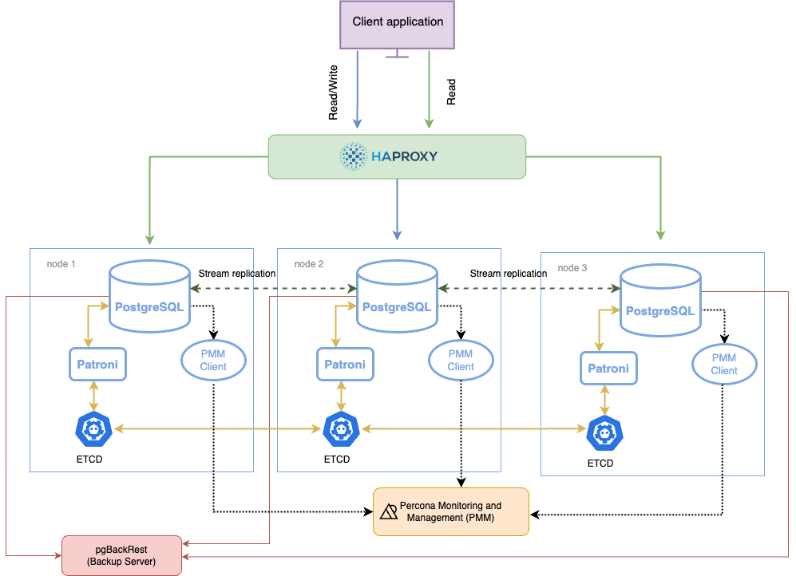

# PostgreSQL High Availability (Patroni, Etcd, HAproxy)

# Mô hình thực tế


[GG][patroni][https://docs.percona.com/postgresql/15/solutions/high-availability.html]

- Patroni là một template định nghĩa cụm Postgresql
- Etcd lư trữ trạng thái postgresql
- HAProxy là loadbalnce và là điểm truy cập duy nhất

# Chi tiết cài đặt

- install percona cho postgresql
- install gói cần thiết cho patroni và ectd
- install ectd, patroni
- và các thiết lập để làm sao ta dựng lên được cụm ectd, tiếp theo cấu hình cụm và từ đó ta có thể control được postgresql

# Thực hiện trên cả `3 servers`

Cài đặt Percona cho PostgreSql

## Cài đặt percona cho postgresql

```bash
wget https://repo.percona.com/apt/percona-release_latest.$(lsb_release -sc)_all.deb
dpkg -i percona-release_latest.$(lsb_release -sc)_all.deb
apt update -y
percona-release setup ppg-15
apt install -y percona-ppg-server-15
systemctl status postgresql
```

## Cài partroni, etcd, pgBackRest

```bash
apt install -y python3-pip python3-dev binutils

apt install percona-patroni etcd etcd-server etcd-client percona-pgbackrest -y

systemctl stop {etcd,patroni,postgresql} && systemctl disable {etcd,patroni,postgresql}

## Để setup ectd cluster, mặc dù patroni có thể sử dụng bản cài đặt postgres hiện có nhưng ta sẽ xóa toàn bộ dữ liệu mà ta vừa cài postgres đi để cái patroni khi được khởi tạo cụm mới thì sẽ khởi tạo luôn từ đầu các giá trị và các cấu hình dử liệu
rm -rf /var/lib/postgresql/15/main
```

# Thực hiện trên `server 1`

Cấu hình etcd cluster: ta có 2 phương pháp:

- đầu tiên join một cụm với nhiều node
- cách hai là khởi tạo cụm ban đầu và từ từ join các node mới vào
  ==> cách 2 có ưu điểm hơn, ví dụ khi ta sizing ta đang cấu hình với một master và 2 slave, hoặc 1 primary và 2 replica, nhưng mà khi dự án ta lớn lên tức là ta sẽ phải thêm tài nguyên, cũng chính xác như vậy ta sẽ phải add những node, ví dụ ta có 3 server ban đầu thì ta sẽ add server 4,5,6 thì lúc này cụm ta sẽ phải 6 node chứ không phải node như ban đầu

==> Bây giờ sẽ khởi tạo một cụm ban đầu với chỉ duy nhất một node, rồi ta sẽ join server 2 và 3 vào node 1

## Mở file cấu hình etcd

```bash
 vi /etc/etcd/etcd.conf.yaml
```

## Với nội dung sau

```ini
name: 'server-1'
initial-cluster-token: postgresql_cluster_viettu
initial-cluster-state: new # new bởi vì ta khởi tạo ban đầu
initial-cluster: server-1=http://192.168.72.11:2380
data-dir: /var/lib/etcd # thư mục gốc của ectd
initial-advertise-peer-urls: http://192.168.72.11:2380
listen-peer-urls: http://192.168.72.11:2380
advertise-client-urls: http://192.168.72.11:2379
listen-client-urls: http://192.168.72.11:2379
```

## Khởi động dịch vụ etcd

```bash
systemctl start etcd && systemctl enable etcd
```

## Kiểm tra etcd cluster

```bash
etcdctl --endpoints=http://192.168.72.11:2379 member list
# 4bfed2708f5eed85, started, server-1, http://192.168.72.11:2380, http://192.168.72.11:2379, false ## khởi tạo thành công một cụm ectd với một node
```

## Join etcd `server 2` vào `server 1` (thực hiện trên `server 1`)

```bash
etcdctl --endpoints=http://192.168.72.11:2379 member add server-2 --peer-urls=http://192.168.72.12:2380

# root@server-1:~# etcdctl --endpoints=http://192.168.72.11:2379 member add server-2 --peer-urls=http://192.168.72.12:2380
# Member efe1684be2115f9e added to cluster 7a55ba4ab2e3b6ef

# ETCD_NAME="server-2"
# ETCD_INITIAL_CLUSTER="server-1=http://192.168.72.11:2380,server-2=http://192.168.72.12:2380" # chính xác bây giờ ta có thêm một dịa chỉ ở INITIAL_CLUSTER
# ETCD_INITIAL_ADVERTISE_PEER_URLS="http://192.168.72.12:2380"
# ETCD_INITIAL_CLUSTER_STATE="existing" # trạng thái bây giờ không phải `new` mà là `existing`
```

# Thực hiện trên server 2

Cấu hình etcd cluster

## Mở file cấu hình etcd

```bash
vi /etc/etcd/etcd.conf.yaml
```

## Với nội dung sau

```yaml
name: "server-2"
initial-cluster-token: postgresql_cluster_viettu
initial-cluster-state: existing
initial-cluster: server-1=http://192.168.72.11:2380,server-2=http://192.168.72.12:2380
data-dir: /var/lib/etcd
initial-advertise-peer-urls: http://192.168.72.12:2380
listen-peer-urls: http://192.168.72.12:2380
advertise-client-urls: http://192.168.72.12:2379
listen-client-urls: http://192.168.72.12:2379
```

## Khởi động dịch vụ etcd

```bash
systemctl start etcd && systemctl enable etcd
```

==> quay lại server 1 kiểm tra

# Thực hiện trên `server 1`

Cấu hình etcd cluster

## Kiểm tra etcd cluster

```bash
 etcdctl --endpoints=http://192.168.72.11:2379 member list

# root@server-1:~# etcdctl --endpoints=http://192.168.72.11:2379 member list
# 4bfed2708f5eed85, started, server-1, http://192.168.72.11:2380, http://192.168.72.11:2379, false
# efe1684be2115f9e, started, server-2, http://192.168.72.12:2380, http://192.168.72.12:2379, false
```

## Join etcd server 3 vào server 1

```bash
etcdctl --endpoints=http://192.168.72.11:2379 member add server-3 --peer-urls=http://192.168.72.13:2380
```

---

# Thực hiện trên server 3

Cấu hình etcd cluster

## Mở file cấu hình etcd

```bash
vi /etc/etcd/etcd.conf.yaml
```

## Với nội dung sau

```yaml
name: "server-3"
initial-cluster-token: postgresql_cluster_viettu
initial-cluster-state: existing
initial-cluster: server-1=http://192.168.72.11:2380,server-2=http://192.168.72.12:2380,server-3=http://192.168.72.13:2380
data-dir: /var/lib/etcd
initial-advertise-peer-urls: http://192.168.72.13:2380
listen-peer-urls: http://192.168.72.13:2380
advertise-client-urls: http://192.168.72.13:2379
listen-client-urls: http://192.168.72.13:2379
```

## Khởi động dịch vụ etcd

```bash
systemctl start etcd && systemctl enable etcd
```

## Thực hiện trên server 1

Cấu hình etcd cluster

## Kiểm tra etcd cluster

```bash
etcdctl --endpoints=http://192.168.72.11:2379 member list

# root@server-1:~# etcdctl --endpoints=http://192.168.72.11:2379 member list
# 482ee66d8220d61f, started, server-3, http://192.168.72.13:2380, http://192.168.72.13:2379, false
# 4bfed2708f5eed85, started, server-1, http://192.168.72.11:2380, http://192.168.72.11:2379, false
# efe1684be2115f9e, started, server-2, http://192.168.72.12:2380, http://192.168.72.12:2379, false
```

==> cài dặt thành công một cụm ectd với 3 node
===> bây giờ đúng như theo cái mô hình ta sẽ cần phải config patroni

---

# Thực hiện trên cả `3 servers`

Cấu hình patroni

## Thêm các biến cần thiết (tạo biến để sử dụng lại)

```bash
export NODE_NAME=`hostname -f | cut -d. -f1`
export NODE_IP=`ip addr show ens33 | awk '/inet / {print $2}' | cut -d/ -f1` # ens33 tùy theo interface trên server
DATA_DIR="/var/lib/postgresql/15/main"
PG_BIN_DIR="/usr/lib/postgresql/15/bin"
NAMESPACE="viettu_percona"
SCOPE="viettu_cluster"
```

## Tạo thư mục chứa password

```bash
mkdir /opt/secretpg

chown -R postgres. /opt/secretpg

chmod -R 700 /opt/secretpg
```

## Tạo file cấu hình patroni /etc/patroni/patroni.yml tham khảo: [https://docs.percona.com/postgresql/15/solutions/ha-setup-apt.html#configure-node3]

<!-- ```yml
postgresql:
    cluster_name: cluster_1
    listen: 0.0.0.0:5432
    connect_address: ${NODE_IP}:5432
    data_dir: ${DATA_DIR}
    bin_dir: ${PG_BIN_DIR}
    pgpass: /tmp/pgpass0 ## vì đây là thư mục không đảm bảo an toàn dữ liệu và các giá trị và rất dễ bị mất mát, nên ta đổi địa chỉ này đi, theo dỏi dưới đây

``` -->

## Tạo thư mục khác (thực hiện trên cả 3 server nha)

```bash
mkdir /opt/secretpg
chown -R postgres:postgres /opt/secretpg/
chmod -R 700 /opt/secretpg/
```

## chạy trên cả 3 server

```yaml
echo "
namespace: ${NAMESPACE}
scope: ${SCOPE}
name: ${NODE_NAME}

restapi:
    listen: 0.0.0.0:8008
    connect_address: ${NODE_IP}:8008

etcd3:
    host: ${NODE_IP}:2379

bootstrap:
  # this section will be written into Etcd:/<namespace>/<scope>/config after initializing new cluster
  dcs:
      ttl: 30
      loop_wait: 10
      retry_timeout: 10
      maximum_lag_on_failover: 1048576

      postgresql:
          use_pg_rewind: true
          use_slots: true
          parameters:
              wal_level: replica
              hot_standby: "on"
              wal_keep_segments: 10
              max_wal_senders: 5
              max_replication_slots: 10
              wal_log_hints: "on"
              logging_collector: 'on'
              max_wal_size: '10GB'
              archive_mode: "on"
              archive_timeout: 600s
              archive_command: "cp -f %p /home/postgres/archived/%f"
              timezone: Asia/Ho_Chi_Minh
              work_mem: 4MB


  # some desired options for 'initdb'
  initdb: # Note: It needs to be a list (some options need values, others are switches)
      - encoding: UTF8
      - data-checksums

  pg_hba: # Add following lines to pg_hba.conf after running 'initdb'
      - host replication replicator 127.0.0.1/32 trust
      - host replication replicator 0.0.0.0/0 md5
      - host all all 0.0.0.0/0 md5
      - host all all ::0/0 md5

  # Some additional users which needs to be created after initializing new cluster
  users:
      admin:
          password: qaz123
          options:
              - createrole
              - createdb
      percona:
          password: qaz123
          options:
              - createrole
              - createdb

postgresql:
    cluster_name: cluster_1
    listen: 0.0.0.0:5432
    connect_address: ${NODE_IP}:5432
    data_dir: ${DATA_DIR}
    bin_dir: ${PG_BIN_DIR}
    pgpass: /opt/secretpg/pgpass
    authentication:
        replication:
            username: replicator
            password: replPasswd
        superuser:
            username: postgres
            password: qaz123
    parameters:
        unix_socket_directories: "/var/run/postgresql/"
    create_replica_methods:
        - basebackup
    basebackup:
        checkpoint: 'fast'

tags:
    nofailover: false
    noloadbalance: false
    clonefrom: false
    nosync: false
" | sudo tee -a /etc/patroni/patroni.yml
```

## Khởi động lại dịch vụ patroni

```bash
systemctl restart patroni && systemctl enable patroni
```

## Kiểm tra cluster

```bash
patronictl -c /etc/patroni/patroni.yml list $SCOPE
```

## kiểm tra

```bash
psql -U postgres
```

```sql
postgres-# SELECT * FROM pg_replication_slots;
```

==> config thành công ectd và patroni postgres

## Cấu hình HAproxy trên cả 3 server

```bash
apt install -y haproxy
```

## Backup và tạo file cấu hình mới

```bash
# backup file
mv /etc/haproxy/haproxy.cfg /etc/haproxy/haproxy.cfg.org

vi /etc/haproxy/haproxy.cfg
```

## Với cấu hình sau

```plaintext
global
    maxconn 100

defaults
    log global
    mode tcp
    retries 2
    timeout client 30m
    timeout connect 4s
    timeout server 30m
    timeout check 5s

listen stats
    mode http
    bind *:7000
    stats enable
    stats uri /

listen primary
    bind *:5000
    option httpchk /primary
    http-check expect status 200
    default-server inter 3s fall 3 rise 2 on-marked-down shutdown-sessions
    server node1 192.168.72.11:5432 maxconn 100 check port 8008
    server node2 192.168.72.12:5432 maxconn 100 check port 8008
    server node3 192.168.72.13:5432 maxconn 100 check port 8008

listen standbys
    balance roundrobin
    bind *:5001
    option httpchk /replica
    http-check expect status 200
    default-server inter 3s fall 3 rise 2 on-marked-down shutdown-sessions
    server node1 192.168.72.11:5432 maxconn 100 check port 8008
    server node2 192.168.72.12:5432 maxconn 100 check port 8008
    server node3 192.168.72.13:5432 maxconn 100 check port 8008
```

## Khởi động lại HAproxy

```bash
systemctl restart haproxy
```

## Để đảm bảo xem cấu hình đúng chưa

```bash
# install jq
apt install jq
curl -s localhost:8008/primary | jq


# root@server-1:/opt# curl -s localhost:8008/primary | jq
# {
#   "state": "running",
#   "postmaster_start_time": "2024-08-20 09:18:15.719209+00:00",
#   "role": "master",
#   "server_version": 150007,
#   "xlog": {
#     "location": 167772160
#   },
#   "timeline": 5,
#   "replication": [
#     {
#       "usename": "replicator",
#       "application_name": "server-2",
#       "client_addr": "192.168.72.12",
#       "state": "streaming",
#       "sync_state": "async",
#       "sync_priority": 0
#     }
#   ],
#   "dcs_last_seen": 1724146665,
#   "database_system_identifier": "7405141723524319250",
#   "patroni": {
#     "version": "3.3.0",
#     "scope": "viettu_cluster",
#     "name": "server-1"
#   }
# }

curl -s localhost:8008/replica | jq

# root@server-1:/opt# curl -s localhost:8008/replica | jq
# {
#   "state": "running",
#   "postmaster_start_time": "2024-08-20 09:18:15.719209+00:00",
#   "role": "master",
#   "server_version": 150007,
#   "xlog": {
#     "location": 167772160
#   },
#   "timeline": 5,
#   "replication": [
#     {
#       "usename": "replicator",
#       "application_name": "server-2",
#       "client_addr": "192.168.72.12",
#       "state": "streaming",
#       "sync_state": "async",
#       "sync_priority": 0
#     }
#   ],
#   "dcs_last_seen": 1724146745,
#   "database_system_identifier": "7405141723524319250",
#   "patroni": {
#     "version": "3.3.0",
#     "scope": "viettu_cluster",
#     "name": "server-1"
#   }
# }
```

## bây giờ đã config replica, tiến hành kết nối đến postgrql

```bash
psql -U postgres -h 192.168.72.11 -p 5000

# username: postgres
# password: qaz123

postgres=# create database viettudb;
```

```sql
root@server-1:/opt# psql -U postgres -h 192.168.72.11 -p 5000
postgres=# create database viettudb;

root@server-1:/opt# psql -U postgres -h 192.168.72.11 -p 5001 -- 5001 là port replica
postgres=# create database viettudb1;
ERROR:  cannot execute CREATE DATABASE in a read-only transaction
postgres=#
```

# ===> Nâng cao hơn có thể cấu hình VIP (giống Mongodb)
